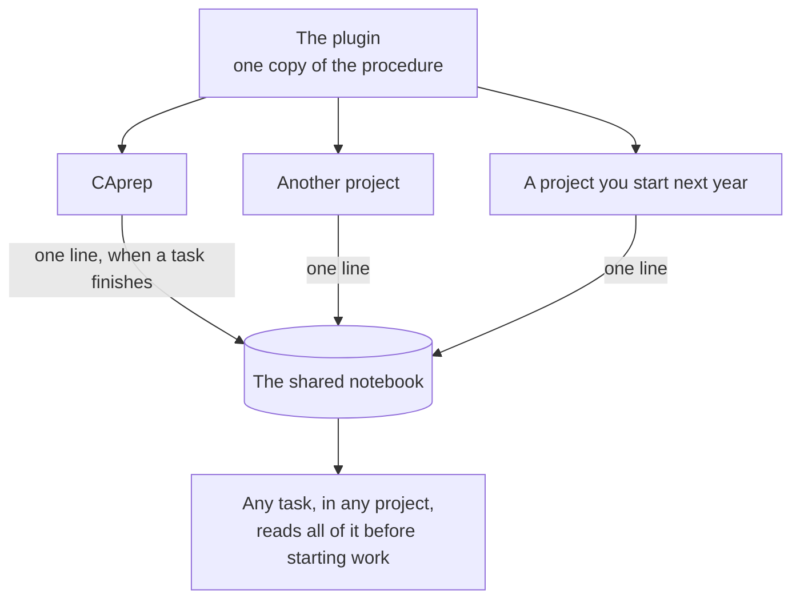

# 01 — The whole system, at a glance

## What this is saying

There are exactly **two** shared things, and everything else is per-project.

**The plugin* holds the procedure.** One copy, in one place. When you improve how
work gets done, you improve it there and every project gets the improvement. You
never copy a fix into five repositories by hand.

> \*plugin — a bundle of instructions and commands you install once into Claude
> Code, after which it is available in every project you open.

**The notebook holds the history.** Every project writes one line into it when a
task finishes; every project can read all the lines. That is what lets a task in
a brand-new project benefit from something learned in CAprep eight months ago.

**Everything else stays inside its own project** — the task folders, the reports,
the maps, the rules file. Those describe one codebase and are meaningless outside
it, so they never leave it.

## Why it is built this way

The alternative was to keep a copy of the procedure inside each project. That is
simpler to set up and it was genuinely tempting — no plugin to install, nothing
to learn.

It was rejected because of what happens over time. Copies drift. Six months in,
five projects each have a slightly different version of the procedure, and the
improvement you made in one never reaches the other four. You would not be able
to answer the question "which version am I actually running here?" — and neither
would I.

One copy means one answer to that question, permanently.
