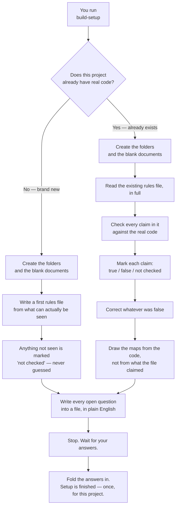

# 02 — The first time, in a new project

This is the flowchart you drew, built as it stands.

## What this is saying

Both branches start the same way, because the folder structure is the same
everywhere. They differ in what there is to *find out*.

**A new project has nothing to verify** — there is no code to check claims
against. So the work is to write down what is actually visible, and be honest
about the rest. Anything not seen is marked "not checked" rather than filled in
with a sensible-sounding guess.

**An old project has the opposite problem.** There is plenty written down, and
some of it stopped being true a while ago without anyone noticing. So every claim
gets checked against the real code, and the false ones get corrected. The maps get
drawn from the code itself, never from the existing notes — otherwise a wrong note
just gets copied into a new document and looks more official.

**Both branches end by asking you.** In writing, numbered, plain English, with a
recommendation on each — so you can answer when it suits you. If a key* is
needed, it is named exactly and you paste it in. It is never guessed at, and the
setup never pretends to have one.

> \*key — a password-like string that lets a program use an outside service. It
> is never written into any file that gets pasted into a chat.

## Why it stops and waits

It would be faster to make reasonable assumptions and carry on. That was
rejected, and it is the same reasoning as everywhere else in this system: an
assumption you cannot check looks exactly like a fact you can. Setup is the
foundation every later task stands on, so a wrong assumption here does not stay
here — it quietly propagates into every task that follows.

Waiting once costs you ten minutes. A wrong foundation costs you months of
subtly wrong work you have no way to spot.
