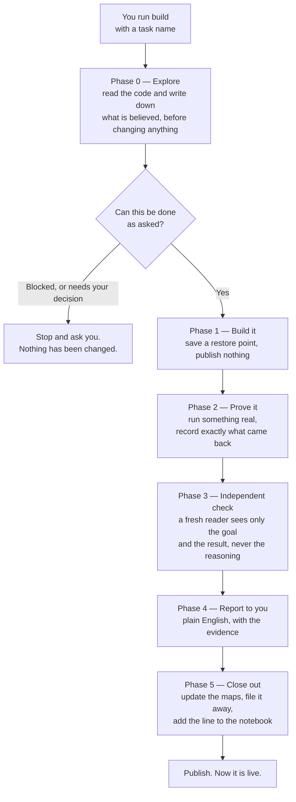

# 03 — A task, from start to finish

## What this is saying

The order is the whole point, and one fact controls it: **nothing becomes live
until Phases 2, 3 and 4 have passed.** Phase 1 saves its work locally, but that
is a restore point, not a release. Publishing is the last thing that happens, in
Phase 5, after everything has been proved and reported.

Each phase exists to catch something a different one cannot:

**Phase 0 writes down what it believes before touching anything.** Once code has
been written, the reasoning bends to fit what was built. Written first, it can be
compared against what actually happened.

**Phase 2 has to run something outside itself** — a real build, a real query, a
real screenshot — and paste in what actually came back. Not a summary, and not
"verified working". The reasoning can be flawless and still be wrong about the
real system, and only an outside answer carries information that was not already
in the model's head.

**Phase 3 shows a fresh reader only the goal and the result** — never the
reasoning that produced it. Someone who knows what they meant reads that meaning
back into their own work and cannot see the gap. Someone who only sees the goal
and the result can. This is the check that catches working code that solves the
wrong problem, which every other check would pass.

**Phase 5 is separate from Phase 4 on purpose.** The tidying-up — maps, filing,
the notebook line, publishing — used to be the tail end of the report. When a
session ended early, a run that had written its report *looked* finished while
none of that had happened. As its own phase, unfinished work is visible: the task
folder is still sitting in the "active" folder.

## Why there is no short version for small tasks

You asked for this to be decided by the system rather than typed by you, and that
is how it is built: at Phase 4 the actual size of the change is measured, and a
genuinely tiny one gets a single merged report instead of two documents. It says
which it chose, so you can disagree with a decision you can see.

But **no phase is ever skipped**, however small the task looks. The reason is
that "this is a small change" is a judgment about the code — exactly the judgment
you have said you cannot make, and the one the whole procedure exists to replace.
A task that looks small and is not is precisely the case that needs the checks.
