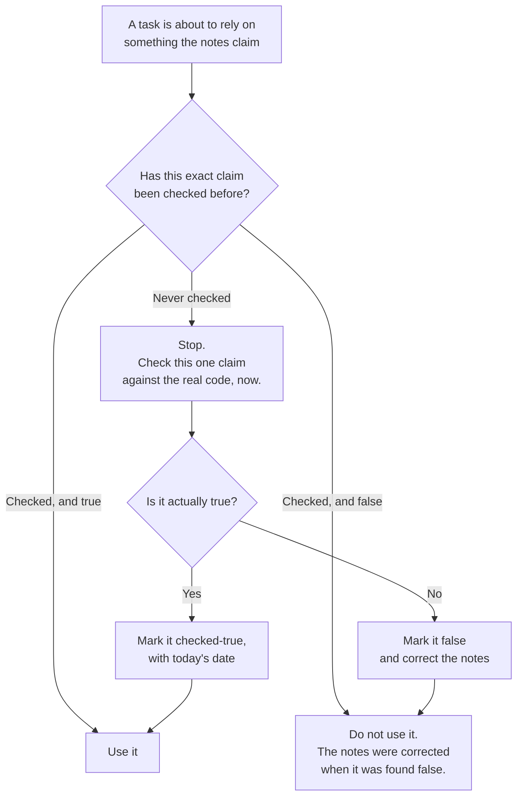

# 04 — How a claim gets checked before it is trusted

This is the answer to your question about verifying everything.

## What this is saying

Every claim in a project's notes carries one of three marks: **checked-true**,
**checked-false**, or **never checked**. The mark, and the date it was checked,
live in a single list.

The rule that makes the marks worth keeping: **a never-checked claim may not be
used as the basis for a decision.** When a task needs one, it stops and checks
that one claim first, then records what it found. So the checking happens
continuously, driven by what work actually touches.

## Why it is not all checked up front

You said you would prefer everything checked, and if not now then before each
task. This is the second version, and here is the reasoning for it.

Checking every claim in a large project against the code, on day one, would be
the single most expensive thing this system ever does. And most of that spend
would buy nothing: the majority of claims describe parts that no upcoming task
will go near. You would pay for certainty about code you never touch.

**The split:** setup checks the *structural* claims — does this file exist, does
this screen exist, does this table exist. Those are mechanical, quick, bounded,
and they are the ones most likely to have quietly rotted. Everything else is
marked never-checked, honestly.

Then every task afterwards checks whatever it is about to rely on.

The result is the same place full verification would reach, arrived at gradually,
paying only where the answer changes a decision. And in the meantime nothing can
act on an unverified belief — which was the actual thing you wanted protection
from.

## The one rule that must not be broken

**Never mark something checked-true without really checking it.**

A never-checked mark is honest and safe: it forces a look before anything relies
on it. A false checked-true mark is worse than having no list at all, because it
converts an open question into a settled fact, and nothing downstream will ever
look again.
