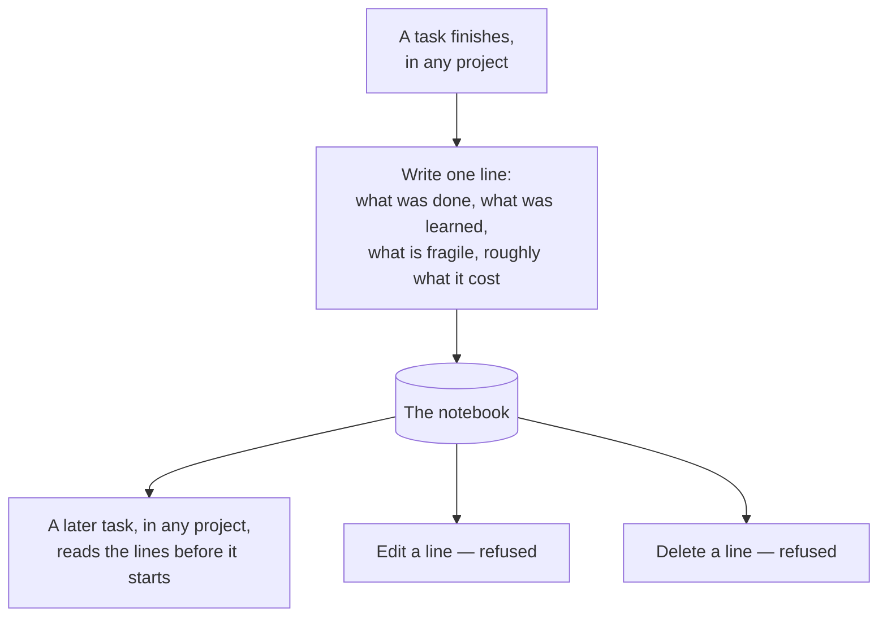

# 05 — The shared notebook

## What this is saying

One line per finished task, from every project, all in one place. Reading is open
to any project. **Editing and deleting are refused — not discouraged, refused.**

## Why the refusal is built the way it is

You said cross-project memory should be strictly read-only, no editing. There
were two ways to deliver that.

**The easy way** was to write "never edit a past entry" as a rule in the
procedure. That is one line of text and it works most of the time.

**The way it is actually built** is that the database* itself was given permission
to add rows and permission to read rows, and *no permission at all* to change or
remove them. The refusal comes from the storage, not from a rule anyone has to
remember.

> \*database — the place the lines are stored. Here it is a small free Supabase
> project, separate from CAprep's, holding one table and nothing else.

The reason for preferring the second: an instruction is a hope. Any session,
including a future me, might decide it has a good reason to tidy up an entry that
looks wrong. A permission that was never granted cannot be reasoned around. For a
record whose entire value is that it is trustworthy history, that difference
matters more than the convenience it costs.

**And it does cost something, honestly:** a wrong entry can never be corrected,
only followed by a later one saying something different. That is the trade, and
it is the right way round for a log.

## What goes in, and what never does

**In:** what the task was, whether it worked, roughly what it cost, what
contradicted what you believed, what was learned, and what was noticed as fragile
but deliberately left alone.

**Never:** a password, a key, a connection string. Anyone holding the notebook's
key can read every line, and that key sits in a settings file. Build history is a
fine thing to keep somewhere like that. A secret is not, and the procedure has a
standing rule against it.

## Why it stores lessons rather than the actual changes

A line is written to be read months later by a session working on a *different*
project. Technical details of a change do not survive that journey — different
code, different language, nothing transfers.

What does transfer is the shape of the lesson. "The sync script runs from the
working folder, so an unsaved edit is already live behaviour" is useful to
somebody who has never seen that script and never will. So the notebook holds
sentences written for a stranger, because a stranger is exactly who reads them.
