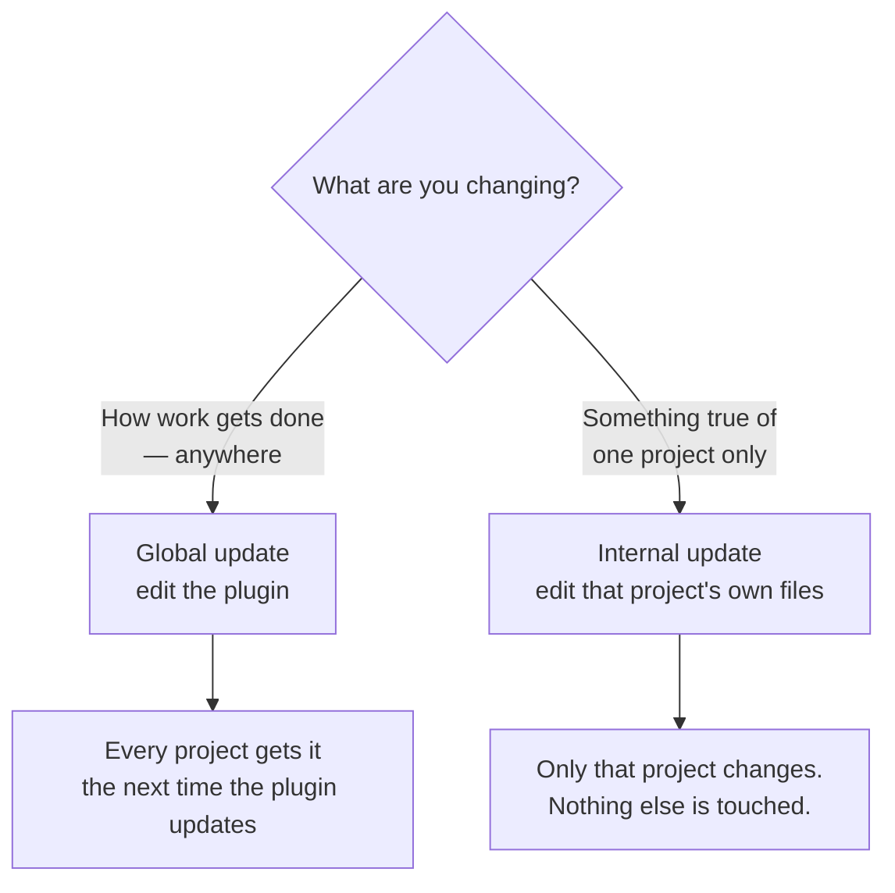

# 06 — The two kinds of update

The distinction you asked for: changes to the procedure itself, versus changes to
one project.

## How to tell which one you are doing

Ask: **would this be true in a project I have not started yet?**

If yes, it is global. A new phase, a changed rule, a better way of reporting, a
question that should always be asked — these describe how *you* want work done,
and they belong in the plugin.

If no, it is internal. What this project's screens are, which file must never be
edited while it is running, what this codebase calls things — these describe one
codebase and are meaningless anywhere else.

## Where each one physically lives

**Global** — the `build-task` repository. One place, and updating it updates every
project.

**Internal** — that project's own `CLAUDE.md` (its rules), `docs/maps` (what the
code actually looks like), and `build-task.config.json` (its settings: which
folders, which build command, which files are live).

## Why they are kept apart

Two failures, one in each direction, and both are ugly.

**A lesson from one project leaking into the procedure.** You learn something
about how CAprep's calendar behaves, it gets written into the shared procedure,
and now every project — including ones with no calendar — carries a rule about it
forever. The procedure slowly fills with facts about one codebase and stops being
general.

**A fix to the procedure trapped inside one project.** You improve how reports are
written, but it lives in CAprep's own files, so the other four projects keep the
old behaviour. You would have to remember to copy it, and eventually you would
not.

Keeping the two apart means each change has exactly one correct home, and the
question "where does this go?" always has an answer.

## The rule for the shared procedure

The procedure's own rules file is read on **every turn of every session**, so a
line added there is paid for forever, in every project, for as long as it exists.

That is why anything added to it has to be paid for by tightening or merging
something else — and why no rule is ever deleted just to make room. Wording gets
tightened, duplicates get merged, explanation moves to the background file that
is only read when needed. Instructions themselves stay.
