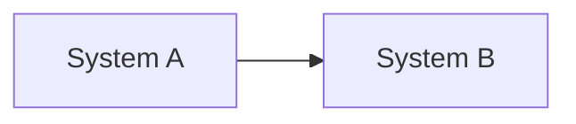

# 00 — Systems: what connects to what

> **The connection map.** Most tasks change logic *inside* a system without
> changing what connects to what — update this file only when a connection
> actually changed, never because a figure moved.
>
> A map is a hypothesis. **When this file and the code disagree, the code is
> right.** Record the disagreement rather than quietly rewriting either one.

*Last verified: YYYY-MM-DD · Coverage: <how much of the project this reflects>*

## The systems

<One short section per system: what it is responsible for, and nothing else.>

## What talks to what

## Entry points

<Where execution actually starts: routes, commands, scheduled jobs, event
handlers. Cite `file.ext:line`.>

## Not yet mapped

<Named honestly. The first task that touches one of these maps it properly.>

## Changelog

- YYYY-MM-DD — created during setup.
